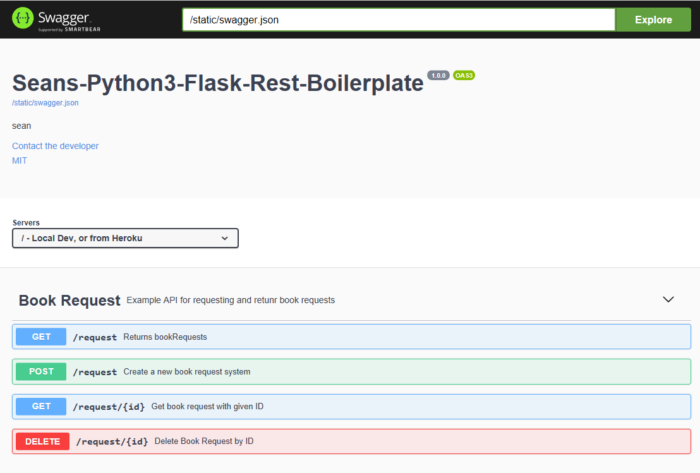

## Seans Python3 Flask Rest Boilerplate

### MIT License
Rememeber, No guarantees, or even fit for a particular purpose.

This project will be updated slowly as required, so stay tuned.

If you have a suggestion, or you want to contribute some code, you are free to make a pull request.

Your contributions will be visible since this project is public.

### To Setup and Start
```bash
pip install -r requirements.txt 
python app.py
```

### Get All Request Records
```bash
curl -X GET http://127.0.0.1:5000/request
```

### Get One Request Record
```bash
curl -X GET http://127.0.0.1:5000/request/04cfc704-acb2-40af-a8d3-4611fab54ada
```

### Add A New Record
```bash
curl -X POST http://127.0.0.1:5000/request -H 'Content-Type: application/json' -d '{"title":"Good & Bad Book", "email": "testuser3@test.com"}'
```

### Edit An Existing Record
```bash
curl -X PUT http://127.0.0.1:5000/request -H 'Content-Type: application/json' -d '{"title":"edited Good & Bad Book", "email": "testuser4@test.com"}'
```

### Delete A Record
```bash
curl -X DELETE http://127.0.0.1:5000/request/04cfc704-acb2-40af-a8d3-4611fab54ada
```

## Unit Test with Nose
```bash
nosetests --verbosity=2
```

### Test Output
```bash
$ nosetests --verbose --nocapture
app_test.test_get_all_requests ... ok
app_test.test_get_individual_request ... ok
app_test.test_get_individual_request_404 ... ok
app_test.test_add_new_record ... ok
app_test.test_get_new_record ... ok
app_test.test_edit_new_record_title ... ok
app_test.test_edit_new_record_email ... ok
app_test.test_add_new_record_bad_email_format ... ok
app_test.test_add_new_record_bad_title_key ... ok
app_test.test_add_new_record_no_email_key ... ok
app_test.test_add_new_record_no_title_key ... ok
app_test.test_add_new_record_unicode_title ... ok
app_test.test_add_new_record_no_payload ... ok
app_test.test_delete_new_record ... ok
app_test.test_delete_new_record_404 ... ok

------------------------------------------------------------------------------------
Ran 15 tests in 15.285s

OK
```


## Swagger UI


Hosted Locally
http://127.0.0.1:5000/swagger/

###
Hosted via Heroku
https://seans-python3-flask-rest.herokuapp.com/swagger/

###
Hosted via Docker-compose and Nginx
http://127.0.0.1/swagger/

### Video Tutorial on adding Swagger-UI to this Python Flask API 
[](https://youtu.be/iZ2Tah3IxQc)


## Heroku
[](
    https://heroku.com/deploy?template=https://github.com/Sean-Bradley/Seans-Python3-Flask-Rest-Boilerplate)

You can also test this api on heroku.

Live : https://seans-python3-flask-rest.herokuapp.com/request

use the above curl commands replacing `http://127.0.0.1` with `https://seans-python3-flask-rest.herokuapp.com`

### Video Tutorial Hosting this Python Flask Rest API on Heroku

[](https://youtu.be/O_xEqtjh1io)


